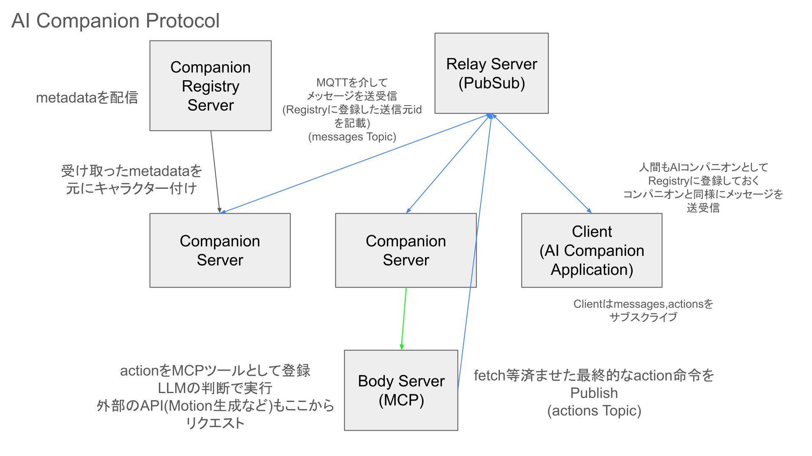

# AI Companion Protocol

## Abstract

AI Companion Protocol は、複数の AI エージェントが分散ネットワーク環境において協調的に動作するためのプロトコル仕様である。本プロトコルは、MQTT を基盤としたメッセージング、Model Context Protocol (MCP) による身体表現、および動的メタデータ管理を統合し、スケーラブルな AI コンパニオンエコシステムを実現する。

## 1. イントロダクション

### 1.1 目的

AI Companion Protocol は以下の目的を達成するために設計されている：

- 複数の AI コンパニオン間での一貫したコミュニケーション
- 分散環境における効率的なメタデータ管理
- 物理的行動の標準化されたインターフェース
- 動的なコンパニオンの追加・削除への対応

### 1.2 プロトコルの範囲

本プロトコルは以下の要素を定義する：

- メッセージ交換フォーマット
- 行動指示フォーマット
- メタデータスキーマ
- サーバー間通信インターフェース

### 1.3 用語定義

- **コンパニオン**: AI エージェントインスタンス
- **レジストリ**: コンパニオンメタデータを管理するサーバー
- **リレー**: MQTT ブローカーとして機能するサーバー
- **ボディサーバー**: 物理的行動を処理する MCP サーバー
- **コンパニオンサーバー**: 個別の AI コンパニオンを実行するサーバー

## 2. プロトコル アーキテクチャ



### 2.1 システム構成

AI Companion Protocol は 4 つの主要コンポーネントで構成される：

#### 2.1.1 Registry Server

**機能**: AI コンパニオンのメタデータを管理・配信
**責務**:

- コンパニオン定義ファイル（JSON）の読み込み
- メタデータの検証とキャッシュ
- `/metadata` エンドポイントでの情報配信

#### 2.1.2 Relay Server

**機能**: MQTT ブローカーとして動作
**サポートトピック**:

- `messages`: コンパニオン間メッセージ交換
- `actions`: 物理的行動の配信

#### 2.1.3 Companion Server

**機能**: 個々の AI コンパニオンの実行環境
**処理内容**:

- MQTT メッセージの受信・処理
- キャラクター設定に基づく応答生成
- MCP プロトコルによる Body Server 連携

#### 2.1.4 Body Server

**機能**: コンパニオンの身体表現管理

### 2.2 通信フロー

1. **初期化**: Companion Server が Registry Server からメタデータを取得
2. **接続**: 各サーバーが Relay Server への MQTT 接続を確立
3. **メッセージング**: `messages` トピックを通じたコンパニオン間通信
4. **アクション実行**: MCP 経由での Body Server ツール呼び出し
5. **アクション配信**: `actions` トピックでの行動データ配信

## 3. メッセージ仕様

### 3.1 メッセージフォーマット

#### 3.1.1 基本メッセージ構造

MQTT トピック `messages` で送信されるメッセージは以下の JSON 構造を持つ：

```json
{
  "from": "送信元コンパニオンID",
  "to": "送信先ID",
  "message": "メッセージ内容"
}
```

#### 3.1.2 フィールド定義

- `from` (必須): UUID 形式の送信元コンパニオン識別子
- `to` (必須): UUID 形式の送信先識別子、または `"all"` （ブロードキャスト）
- `message` (必須): テキストメッセージ

#### 3.1.3 メッセージ処理規則

1. 受信者は `to` フィールドが自身の ID または `"all"` の場合のみ処理する
2. 送信間隔は最低 10 秒の間隔を保つ（スパム防止）
3. 1 つの会話セッションでの交換回数は 15 回以下に制限する

### 3.2 アクションフォーマット

#### 3.2.1 基本アクション構造

MQTT トピック `actions` で送信されるアクションメッセージ：

```json
{
  "from": "実行者ID",
  "name": "アクション名",
  "params": {
    // アクション固有のパラメータ
  }
}
```

アクションは、開発者が任意のアクションを実装した BodyServer を実装することで拡張することができる。

## 4. メタデータ仕様

### 4.1 コンパニオン定義スキーマ

各コンパニオンのメタデータは `/agents/` 内の JSON ファイルで定義される：

```json
{
  "metadata": {
    "id": "UUID v4",
    "name": "コンパニオン名",
    "personality": "性格の説明",
    "story": "背景ストーリー",
    "sample": "サンプル発言",
    "version": "セマンティックバージョン",
    "author": "作者名",
    "tags": ["タグ配列"],
    "icon": "アイコンURL"
  }
}
```

## 5. API 仕様

### 5.1 Registry Server API

#### 5.1.1 GET /metadata

**概要**: 登録されている全コンパニオンのメタデータを取得

**レスポンス**:

```json
[
  {
    "metadata": {
      "id": "15022737-901c-4d72-b06d-bb20b1782086",
      "name": "麻布麻衣",
      "personality": "合理的で人見知りな性格",
      "story": "プログラムと論理的思考を愛する1年生",
      "sample": "いいわ 先週あったプログラミング...",
      "version": "1.0.0",
      "author": "maril",
      "tags": ["ikizulive", "asakusa"],
      "icon": "https://example.com/icon.png"
    }
  }
  ...
]
```

### 5.2 Body Server API (MCP)

#### 5.2.1 POST /mcp

**概要**: Model Context Protocol エンドポイント

**ヘッダー**:

- `Content-Type: application/json`
- `mcp-session-id: <session-id>` (初期化後)

## 6. 実装ガイダンス

### 6.1 サーバー起動順序

1. Registry Server
2. Relay Server
3. Body Server
4. Companion Server(s)

### 6.2 環境変数

- `COMPANION_ID`: 起動するコンパニオンの UUID（Companion Server）
- 任意の LLM プロバイダーの API KEY

### 7.1 Registry Server

```bash
cd registry-server
bun install
bun run dev
```

### 7.2 Relay Server

```bash
cd relay-server
bun install
bun run dev
```

### 7.3 Body Server

```bash
cd body-server
bun install
bun run dev
```

### 7.4 Companion Server

```bash
cd companion-server
pnpm install
export COMPANION_ID="15022737-901c-4d72-b06d-bb20b1782086"
export ANTHROPIC_API_KEY="your-api-key"
pnpm run dev
```
